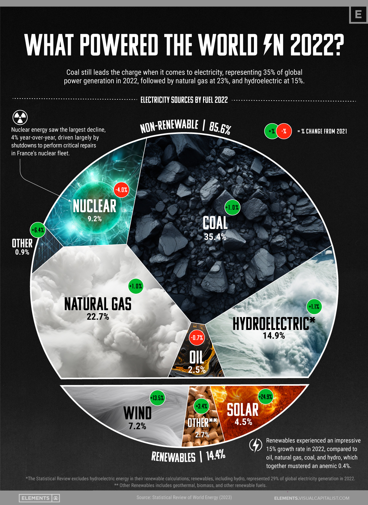
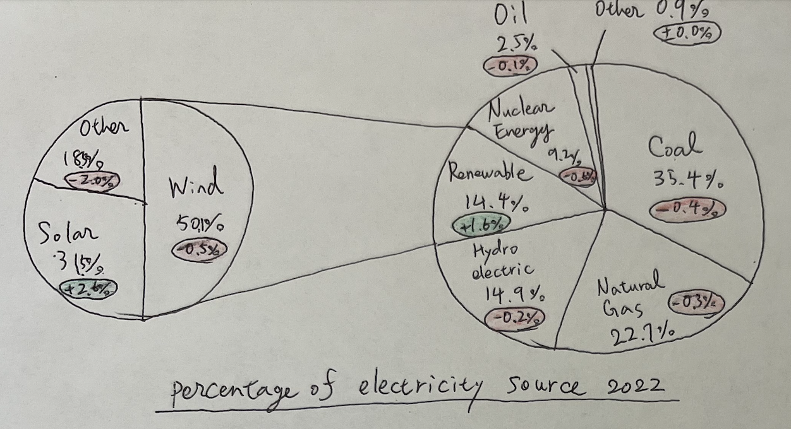
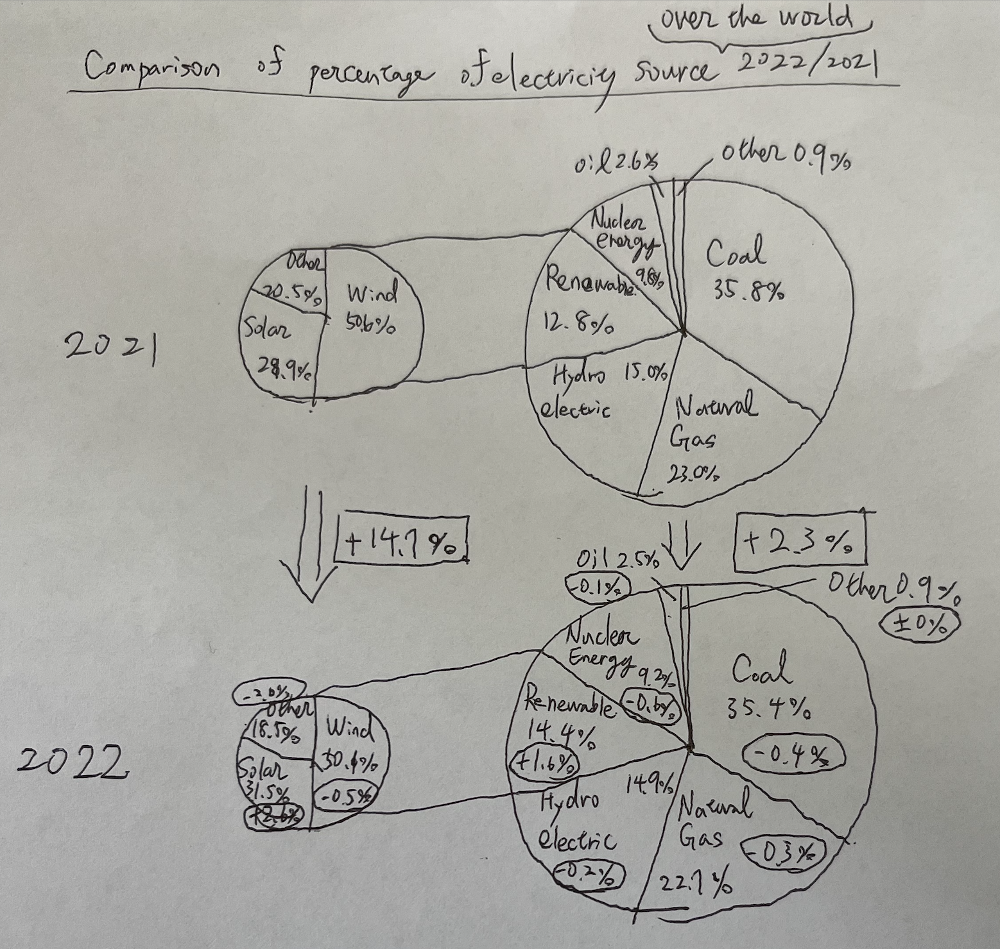

| [Home Page](https://yasu24.github.io/Telling-Story-with-Data/) | [Data Visualization Critiques](data-visualization-critiques.md) | [Data Visualization Workshops](data-visualization-workshops.md) | [Final Project](final-project.md) |

# Data Visualization Critiques
Web page URL: [data-visualization-critiques.html](https://yasu24.github.io/Telling-Story-with-Data/data-visualization-critiques.html)

This repository: [data-visualization-critiques.md](https://github.com/yasu24/Telling-Story-with-Data/blob/main/data-visualization-critiques.md)

# Step one: find a data visualization
The visualization and data I found are as below.

Title and source: [What Electricity Sources Power the World?](https://www.visualcapitalist.com/electricity-sources-by-fuel-in-2022/)

Data Source page: [https://www.visualcapitalist.com/electricity-sources-by-fuel-in-2022/](https://www.energyinst.org/statistical-review)

-> Data file: Statistical Review of World Energy Data: [Link to Excel data download](https://www.energyinst.org/__data/assets/excel_doc/0007/1055545/EI-stats-review-all-data.xlsx)

# Step two: critique the data visualization

## The facts about this diagram

- The diagram lacks clarity on whether the changes are based on percentages or absolute values(it actually　shows absolute values)

- The total electricity production in 2022 increased by 2.3% compared to 2021, which isn't highlighted in the visualization

- In its current broken pie chart, it's challenging to discern the exact percentages. For instance, the section representing renewable energy is labeled as 14.4%. However, upon quick calculation, the actual area of the circle seems to represent only 9.8%

## The consideration and critique of this diagram

- As pointed out above, it appears as though they might be emphasizing the need for cleaner energy sources by making traditional energy sources appear larger than they are

- The visualization is comprehensible for those lacking a critical eye for diagrams, however, we cannot distinguish between Natural gas, Hydroelectric, and wind as they are similar pictures

- Based on the visualization, one might perceive a smaller representation of renewable energy and a larger emphasis on coal and natural gas, with nuclear energy appearing to be on a declining trend

- If the creator's primary intent was to highlight changes, a bar chart would have been more appropriate

- If the goal was to showcase percentages, a simple pie chart would be the optimal choice

- It seems the creator prioritized aesthetics over clarity, but there are alternative ways to present the data attractively, such as integrating visuals into a bar chart. Overall, the current presentation raises some doubts about its intent

- The immediate takeaway for many would likely be, "We are still predominantly using traditional energy sources for electricity." This would be followed by a sentiment that there's a pressing need to transition to renewable energy

- Based on the discussion above, I believe the author wants to lead and cultivate the atmosphere that we need to increase the percentage of renewable energy. In this case, it would be better if we highlight the renewable energy part mainly

# Step three: sketch out a solution

From our discussions, it seems more effective to present absolute values rather than a fragmented pie chart adorned with visuals. My initial approach was to use simple bar charts for both 2022 and 2021, differentiating them with contrasting colors. Noting the original chart's emphasis on renewable resources, I emphasized them using distinct shades.

My subsequent concept revolved around refining the pie chart and rectifying ambiguities in percentage representation from the original. As with the bar chart, I underscored renewable energy, designing an alternative pie chart to reflect this emphasis. I also incorporated the percentage change in absolute value, although it doesn't fully resolve ambiguities like the uncertain basis of the percentages—whether they denote absolute values or shares.

Based on the reflection of the second pie chart, I went deeper with a pie chart. However, I found its limitations evident when visualizing nuances, such as the 2% change in electricity production from 2021 to 2022. Such subtleties are hard to depict with a pie chart, leading me to represent it numerically—an approach that, admittedly, diverges from pure visualization. The final output is presented below.

# Step four: Test the solution

I created the three suggested diagrams as above.

Then I asked some people around me including utilizing the chance in-class activity.

The comments were gathered from 3 x 20s Students, and 1 x 30s adult with showing all diagrams and explanations. 

### Can you tell me what you think this is?
- (all charts)It looks like a share of produced electricity

- (all charts)It shows the electricity produced from several sources

### Can you describe to me what this is telling you?
- (bar chart)It seems like a comparison for 2 years(2021 and 2022)

- (bar chart)The original diagram is misleading, but it says more visually impactful, but the current diagram looks more accurate, so it depends on the audience which diagram to show.

### Is there anything you find surprising or confusing?
- (Simple pie chart and bar chart)Is it about the world? or for One Country? (The target is unclear)

- (Simple pie chart and double pie chart)The simple pie chart is easier to understand, but it doesn't tell a comparison, while a double pie chart is too complicated

- (Simple pie chart and bar chart)If there are both charts, which are bar chart, and pie chart together, it would be more helpful

### Who do you think is the intended audience for this?
- (Bar chart)It depends on the age, but if it's over 12 years old, it can be understood. But it's easier if there is an explanation

- (original chart)Probably people who are interested in environmental-related issues

### Is there anything you would change or do differently?
- (all charts)Maybe add more years or change the year(to be clearer for the change e.g. 2022 vs. 2012)

- (bar chart)It would be better if you can change the color to gray for the unfocused parts

# Step five: Build the solution

Reflecting on the feedback provided, I created the new proposed diagram to show the electricity produced change from 2021 to 2022.

I chose the bar chart as pie charts are tricky to improve and need more consideration　for providing clear explanations. 

Therefore, I applied the shading to the unfocused part and only focused on the renewable energy part to gather the reader's focus.

  <noscript>
    
  </noscript>
  <object class='tableauViz'  style='display:none;'>
    <param name='host_url' value='https%3A%2F%2Fpublic.tableau.com%2F' /> 
    <param name='embed_code_version' value='3' /> 
    <param name='site_root' value='' />
    <param name='name' value='Electricity_16952316906610&#47;Sheet1' />
    <param name='tabs' value='no' />
    <param name='toolbar' value='yes' />
    <param name='static_image' value='https:&#47;&#47;public.tableau.com&#47;static&#47;images&#47;El&#47;Electricity_16952316906610&#47;Sheet1&#47;1.png' /> 
    <param name='animate_transition' value='yes' />
    <param name='display_static_image' value='yes' />
    <param name='display_spinner' value='yes' />
    <param name='display_overlay' value='yes' />
    <param name='display_count' value='yes' />
    <param name='language' value='ja-JP' />
    <param name='filter' value='publish=yes' />
  </object>

                

# Summary

Throughout this project, I critically analyzed a chosen data visualization focusing on energy sources and sought to redesign it. 
My primary motivation for selecting this diagram stems from my observation that the original might subtly guide readers towards a specific viewpoint—specifically, emphasizing the insufficiency of renewable energy utilization.

While I remain neutral on the creator's stance, it's crucial to note that visual presentations can be powerful tools that shape perceptions. 
The original diagram, for instance, could easily lead an uncritical observer in a particular direction, much like the subliminal messages used in other media. 
This influential potential, especially if it veers into ideological or political territory, underscores the importance of ethical data representation.

I embarked on this redesign endeavor to offer a more balanced perspective using the same dataset. 
While I'm curious about how successfully I've achieved this, the journey has been invaluable in fostering a deeper understanding of data visualization's responsibilities and nuances.
