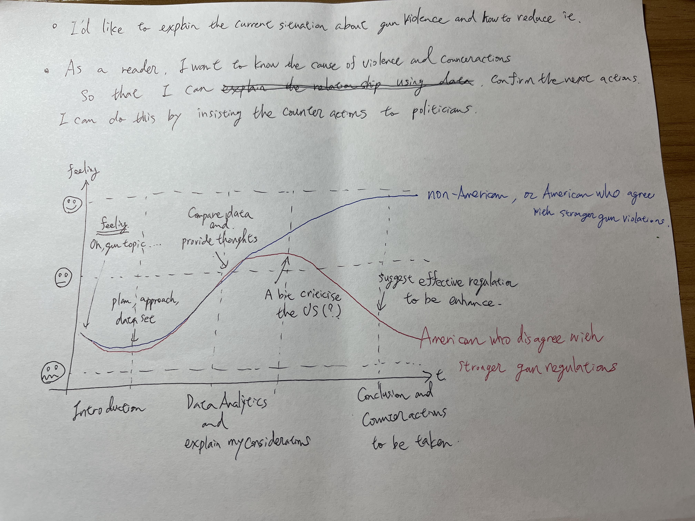
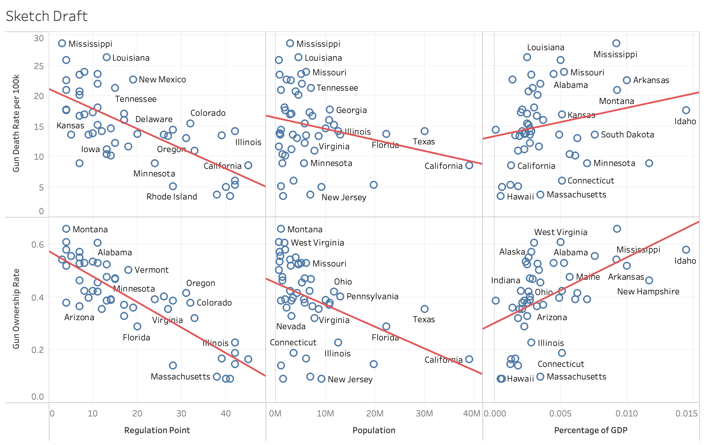

| [Home Page](https://yasu24.github.io/Telling-Story-with-Data/) | [Data Visualization Critiques](data-visualization-critiques.md) | [Data Visualization Workshops](data-visualization-workshops.md) | [Final Project Part1](final-project-part1.md) | [Final Project Part2](final-project-part2.md) | [Final Project Part3](final-project-part3.md) |

# Final Project Part 1

Web page URL: [https://yasu24.github.io/Telling-Story-with-Data/final-project-part1.html](https://yasu24.github.io/Telling-Story-with-Data/final-project-part1.html)

This repository: [https://github.com/yasu24/Telling-Story-with-Data/Final Project Part1](https://github.com/yasu24/Telling-Story-with-Data/blob/main/final-project-part1.md)

## Outline
### A high-level summary of your project

As the Whitehouse announced, President Biden established the "Gun Violence Prevention Office" in Sep 2023.  [Link](https://www.whitehouse.gov/briefing-room/statements-releases/2023/09/21/president-joe-biden-to-establish-first-ever-white-house-office-of-gun-violence-prevention-to-be-overseen-by-vice-president-kamala-harris/)

Since I came to the US, I watched so much gun-related news, even in Pittsburgh. 

Because a gun is not familiar in my home country, Japan, I would like to discover this topic, which is the motivation of the project.

Although it took a long time to see and research if I can provide any good information on the topic, I would like to focus on "Gun violence".

In this project, I would like to find any insight based on crime, regulation, or possibly economic data.

My purpose of the project is to reduce gun violence and victims, therefore the target audience is assumed to be government people.

### A project structure that outlines the major elements of your story.

Audience Analysis is as below. 

I put separate two lines in it, the one is the people who agree with stronger regulation and the other is against it including non-Americans. 

As far as researched so far, I gathered some data such as,
- Gun Death Ratio per 100k people
- Regulation ranking and points including a waiting period
- Mass shooting data
- GDP for each state and gun industry percentage in GDP

The first idea will be to focus on which regulation would effectively reduce gun violence. 

Particularly, I am focusing on the gun waiting period, but more beneficial indicators could be found later in the project.

Also, I couldn't find the trend data for the number of guns possessed, which implies that information is hidden/protected. 

The absence of open data not only obscures the true facts about gun ownership but also creates an environment of uncertainty.

On the other hand, research in 2018 shows that there are 392 million guns in the US, but only 1 million guns are registered guns.

This lack of transparency and clarity can instill psychological fear in people, leading them to purchase guns for their own protection due to the unknown threats.

Moreover, we can compare the percentage of gun homicides ratio out of all homicides with any other countries where guns are not common. 

It might provide the effect of having guns when people have a murderous intent.

The story is fragmental at this stage, but it can be one story, I believe.

## Initial sketches

Because the volume of data is huge, I decided the struggle and reflect on the idea using Tableau.
The initial thought was to compare several data gathered and find any relationship between them, like the draft sketch below.

At the top left is the comparison between the "Gun death ratio" and "Regulation" for each state.

To improve it, I will have to focus on more specific parts, rather than considering using general wide data.

If any specific regulation were more strict, the number of incidents would be lower, due to the time constraints.

I will go deeper and gather more data in the project Part 2 and Part 3.

Only the information I found was that gun regulation can be categorized as below.

** The number in the bracket indicates the maximum number of regulations in the category, so the total point is 50

- (5)Foundational Law	
- (6)Gun Industry and Product Safety	
- (8)Guns in Public	
- (14)Keeping Guns out of the wrong hands	
- (8)Policing and Civil rights	
- (9)Sales and Permission

As of now, I focused that which category regulation is more effective, which shows the slope of the trend graph.

The least effective regulation is "Keeping Guns out of the wrong hands"(coefficient is -1.06).

On the other hand, the most effective regulation is "Gun Industry and Product Safety"(coefficient is -2.02).

I would like to dig more and more based on the direction.

## The data and source
[1] Which state has what kind of gun-related regulation does it have?

Cranford, C. (2023, August 25). States ranked by how strict their gun laws are. Sightmark.com. https://sightmark.com/blogs/news/states-ranked-by-how-strict-their-gun-laws-are 

[2] Same as [1], how to put the point for the regulation of each state

Methodology. Everytown Research &amp; Policy. (2023, September 6). https://everytownresearch.org/rankings/methodology/ 

[3] Information about the waiting period, which means once the person buys the gun, how long would it take time to receive it?

Waiting periods. Giffords. (2023, June 26). https://giffords.org/lawcenter/gun-laws/policy-areas/gun-sales/waiting-periods/ 

[4] Gun ownership ratio data

Gun ownership by State 2023. Wisevoter. (2023, May 8). https://wisevoter.com/state-rankings/gun-ownership-by-state/ 

[5] GDP data for each state

GDP by State. GDP by State | U.S. Bureau of Economic Analysis (BEA). (n.d.). https://www.bea.gov/data/gdp/gdp-state 

[6] Population data for each state

Select a State. Rank List: States in Profile. (n.d.). https://www.statsamerica.org/sip/rank_list.aspx?rank_label=pop1&amp;ct=S18 

[7] Number of guns globally including in the US

Global Firearms Holdings. Small Arms Survey. (n.d.). https://www.smallarmssurvey.org/database/global-firearms-holdings 

## Method and medium

My approach is to find the correlation between several kinds of data using Tableau.

To find any insights to help reduce gun incidents, I would like to I will search for more data that indicates an effective approach.

This is a good, but deep and difficult theme, therefore I might change the topic afterward.

