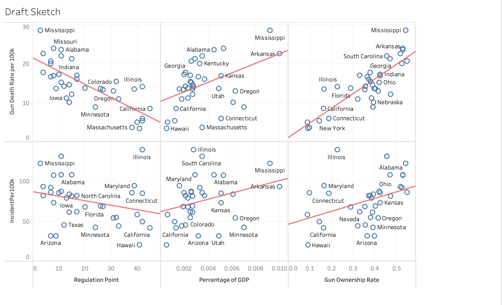
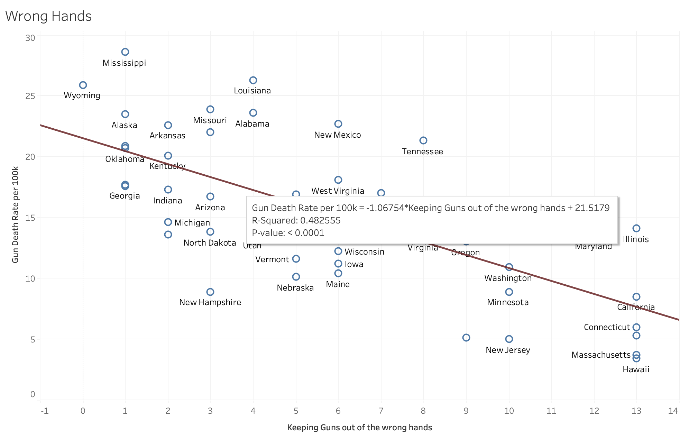
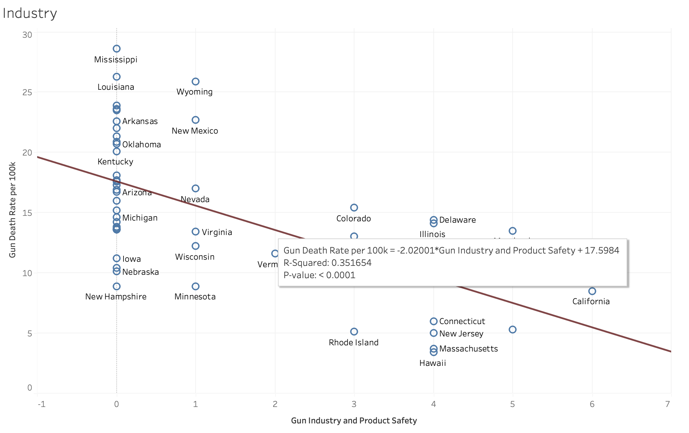

| [Home Page](https://yasu24.github.io/Telling-Story-with-Data/) | [Data Visualization Critiques](data-visualization-critiques.md) | [Data Visualization Workshops](data-visualization-workshops.md) | [Final Project Part1](final-project-part1.md) | [Final Project Part2](final-project-part2.md) | [Final Project Part3](final-project-part3.md) |

# Final Project Part 1

Web page URL: [https://yasu24.github.io/Telling-Story-with-Data/final-project-part1.html](https://yasu24.github.io/Telling-Story-with-Data/final-project-part1.html)

This repository: [https://github.com/yasu24/Telling-Story-with-Data/Final Project Part1](https://github.com/yasu24/Telling-Story-with-Data/blob/main/final-project-part1.md)

## Outline
### A high-level summary of your project

As the Whitehouse announced, President Biden established the "Gun Violence Prevention Office" in Sep 2023.  [Link](https://www.whitehouse.gov/briefing-room/statements-releases/2023/09/21/president-joe-biden-to-establish-first-ever-white-house-office-of-gun-violence-prevention-to-be-overseen-by-vice-president-kamala-harris/)

Since I came to the US, I watched so much gun-related news, even in Pittsburgh. 
Because a gun is not familiar in my home country, Japan, I would like to discover this topic, which is the motivation of the project.
Although it took a long time to see and research if I can provide any good information on the topic, I would like to focus on "Gun violence".
In this project, I would like to find any insight based on crime, regulation, or possibly economic data.
My purpose of the project is to reduce gun violence and victims, therefore the target audience is assumed to be government people.

### A project structure that outlines the major elements of your story.

As far as researched so far, I gathered some data such as,
- Gun Death Ratio per 100k people
- Regulation ranking and points including a waiting period
- Mass shooting data

I want to focus on which regulation would effectively reduce gun violence. I am focusing on the gun waiting period, but more beneficial indicators could be found through the project.
Also, I couldn't find the trend data for the number of guns possessed, which implies that information is hidden/protected. No open data is not data, but fact. 
On the other hand, research in 2018 shows that there are 392 million guns in the US, but only 1 million guns are registered guns.
Also, I would like to know if a gun can be an alternative to knives, so to clarify it, I will compare the incident using knives in a country where a gun is not common and the US.
The story is fragmental at this stage, but it can be one story, I believe.

## Initial sketches

Because the volume of data is huge, I decided the struggle and reflect on the idea using Tableau.
It wouldn't be an actual tool to consider and think about the idea, but it will be a good tool to find a relationship between data.

The initial thought was to compare some data gathered and find any relationship between them.
However, as shown below, it is simply a normal relationship, such as if the regulation is more strict, the number of incidents is lower.

Therefore, I have to focus on more specific parts.
I will go deeper and gather more data in Part 2 and Part 3, but as far as I have, the gun regulation can be categorized as below.
** The number in the bracket shows the maximum point of the category, so the total point is 50

- (5)Foundational Law	
- (6)Gun Industry and Product Safety	
- (8)Guns in Public	
- (14)Keeping Guns out of the wrong hands	
- (8)Policing and Civil rights	
- (9)Sales and Permission

As of now, I focused that which category regulation is more effective, which shows the slope of the trend graph.

The least effective regulation is "Keeping Guns out of the wrong hands".

On the other hand, the most effective regulation is "Gun Industry and Product Safety".

I would like to dig more and more based on the direction.

## The data and source
[1] Cranford, C. (2023, August 25). States ranked by how strict their gun laws are. Sightmark.com. https://sightmark.com/blogs/news/states-ranked-by-how-strict-their-gun-laws-are 

[2] Methodology. Everytown Research &amp; Policy. (2023, September 6). https://everytownresearch.org/rankings/methodology/ 

[3] Waiting periods. Giffords. (2023, June 26). https://giffords.org/lawcenter/gun-laws/policy-areas/gun-sales/waiting-periods/ 

[4] Gun ownership by State 2023. Wisevoter. (2023, May 8). https://wisevoter.com/state-rankings/gun-ownership-by-state/ 

[5] GDP by State. GDP by State | U.S. Bureau of Economic Analysis (BEA). (n.d.). https://www.bea.gov/data/gdp/gdp-state 

[6] Select a State. Rank List: States in Profile. (n.d.). https://www.statsamerica.org/sip/rank_list.aspx?rank_label=pop1&amp;ct=S18 

[7] Global Firearms Holdings. Small Arms Survey. (n.d.). https://www.smallarmssurvey.org/database/global-firearms-holdings 

## Method and medium

My approach is to find the correlation between data using Tableau.

To find any insights to help reduce gun incidents, I would like to I will search for more data that indicates an effective approach.

