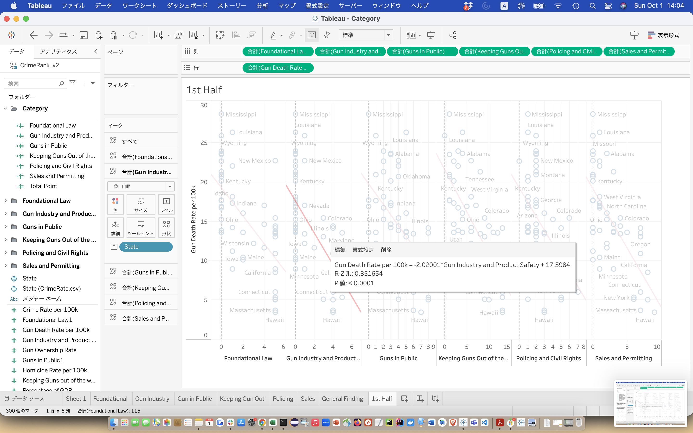

| [Home Page](https://github.com/yasu24/Telling-Story-with-Data) | [Data Visualization Critiques](data-visualization-critiques.md) | [Data Visualization Workshops](data-visualization-workshops.md) | [Final Project Part1](final-project-part1.md) | [Final Project Part2](final-project-part2.md) | [Final Project Part3](final-project-part3.md) |

# Final Project Part 2

# Wireframes/storyboards
> Using your sketches developed last week, further develop your story outline and relevant components visually through the use of wireframing/storyboards. Using your outline as a guide, include high-fidelity, individual draft data visualizations of the critical elements of the story you want to share with your reader. Note: you can build these elements out directly in Shorthand this week if you wish.  Reminder: this template is intended to help, but it doesn't substitute for reading through the full homework assignment!  The assignment page on Canvas includes many important details for completing Part II of the final project. 

## Wireframes

Story:

As the Whitehouse announced, President Biden established the "Gun Violence Prevention Office" in Sep 2023.

This unprecedented move comes after a series of tragic shootings and consistent public outcry for stricter gun control. 

Ever since I moved to the US, I've been exposed to numerous gun-related news stories, including those from Pittsburgh.

Coming from Japan, where guns are far less common, my curiosity about this topic spurred this project.

Given the complexities surrounding American history and culture related to guns, this project will objectively focus on "Gun Violence" rather than debating the merits of gun ownership.

In this project, I would like to find any insight based on crime, regulation, or possibly economic data.

The primary goal of this project is to contribute insights towards reducing gun violence and its victims. As such, the intended audience includes governmental officials and policymakers.

According to the Everytown Gun Law Rankings, the laws are categorized into 6 groups. We are going to focus on which category is the most effective in preventing the death rate and also what kind of laws work and don't work.

Categories
- Foundational Law
- Gun Industry and Product Safety
- Guns in Public
- Keeping Guns out of the wrong hands
- Policing and Civil rights
- Sales and Permitting

Initially, data was compared between "each state's laws" and "the gun death rate per 100k" to clarify which category is the most effective in preventing death using guns.

As shown above, the most efficient category is "Gun Industry and Product Safety". When a regulation is introduced to a state that doesn't have it, the number of deaths is reduced by 2.02 people per 100,000 people.
On the other hand, the least effective one is "Keeping Guns out of the wrong hands", which has only a 1.07 reduction.

If we focus on each regulation, The biggest impacted law is "Training Required to Purchase Guns", which has 9.09 people per 100,000 people.
This regulation is implemented in only 9 states, therefore remaining 41 states can reduce the number of deaths potentially.
Interestingly, the "No Guns in Bars" regulation has the lowest impact with a rate of 0.46, suggesting that restrictions on guns in bars have a lesser influence on gun-related deaths.

It's important to note that this is merely a binary (yes/no) analysis, and a more in-depth examination is necessary. For instance, while the study mentions a "waiting period", we need to consider the exact length of time people must wait after purchasing before actually receiving their guns.

In conclusion, this analysis has identified specific areas of regulation that can significantly reduce gun-related tragedies. While the current study employed a binary approach, future research would benefit from more nuanced methodologies, such as machine learning, to extract deeper insights from the data. 

As I plan to reside in the U.S. for some time, gaining an understanding of this topic has personal significance, and I look forward to delving further into this critical issue.

## Storyboards

# User research 

## Target audience
> Include your approach to identifying representative individuals, and who you hope to reach with your story. 

While the primary target audience is governmental officials and policymakers, public opinion is shaped by the masses. Thus, the general public, especially those concerned with gun regulations, are also considered a significant audience for this project.

## Interview script
> List the goals from your research and the questions you intend to ask. 

The main goal of my research is to contribute insights towards reducing gun violence and its victims. 
The main goal of the interview is to clarify if my explanation is "Understandable", "Informative", and "Enhancement" or not.

| Goal | Questions to Ask |
|------|------------------|
| Understandable | Did you catch what is the main point of the explanation? |
| Informative | Did you get any new insight from the presentation? |
| Enhancement | Were there any parts of the presentation that felt confusing or that could be presented more clearly? |

## Interview findings
> Detail the findings from your interviews.  Do not include PII.  Capture specific insights where possible.

Text here!

| Questions               | Interview 1 (briefly describe) | Interview 2 | Interview 3 |
|-------------------------|--------------------------------|-------------|-------------|
| Did you catch what is the main point of the explanation? | Insightful feedback            |             |             |
| Did you get any new insight from the presentation? |                                |             |             |
| Were there any parts of the presentation that felt confusing or that could be presented more clearly? |                                |             |             |

# Identified changes for Part 3
> Document the changes you plan on implementing next week to address any issues identified.  

Text here!

| Research synthesis                       | Anticipated changes for Part 3                                                  |
|------------------------------------------|---------------------------------------------------------------------------------|
| Findings or observations from interviews | Describe what, if any changes you anticipate making to address the observation. |
|                                          |                                                                                 |
|                                          |                                                                                 |
|                                          |                                                                                 |
| ...add more rows as necessary            |                                                                                 |

> ...include any final thoughts you have here. 

Text here!

# Moodboards / personas
> If you did this optional part, include details here.  Otherwise, remove this section

Text here!
