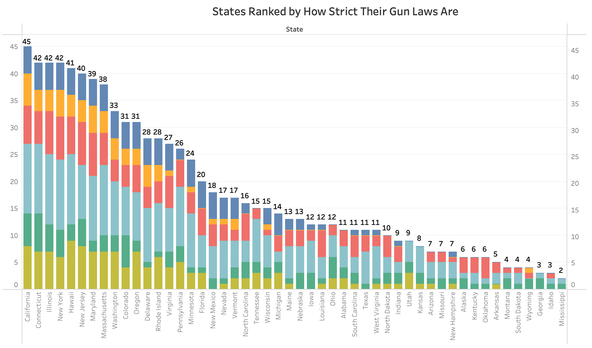
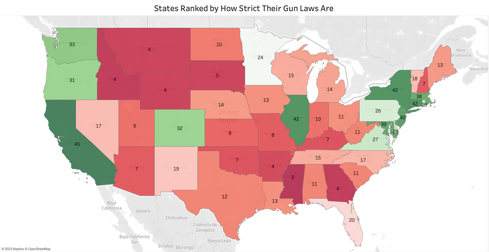
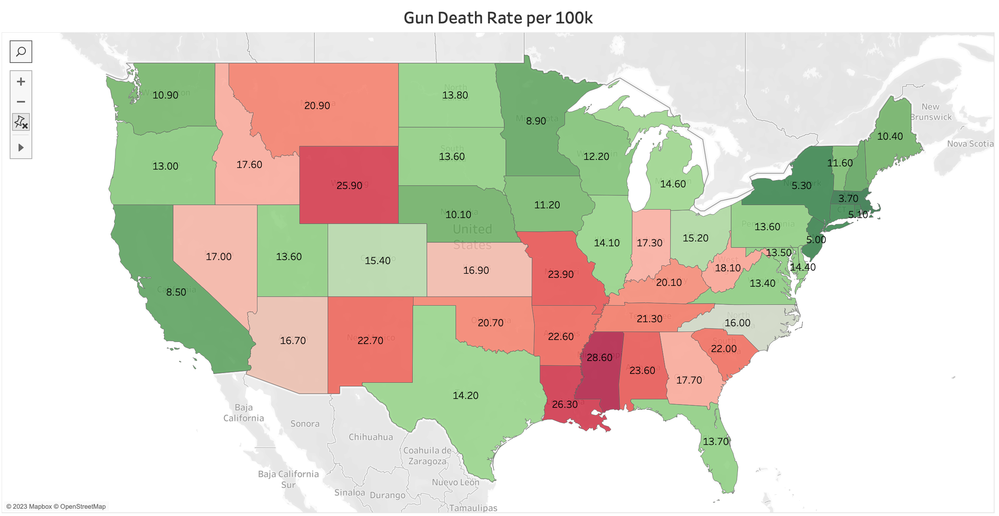
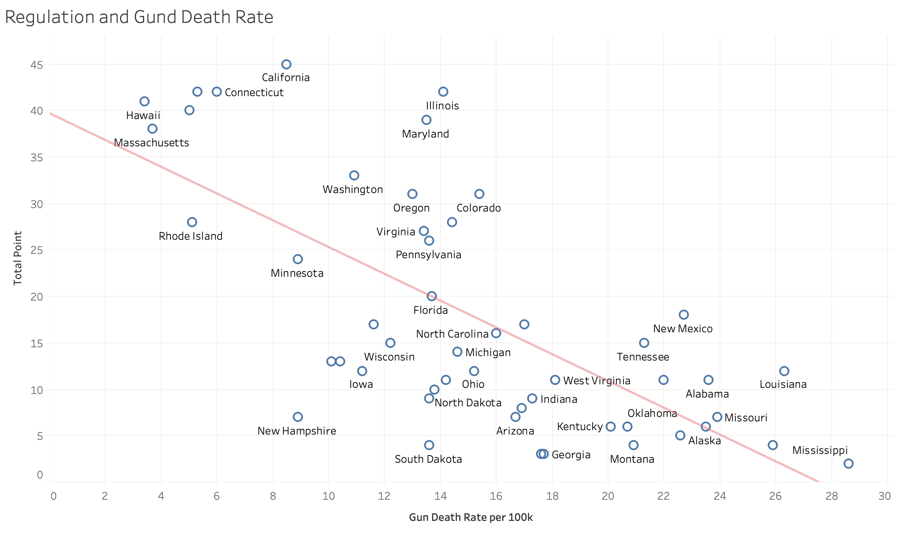
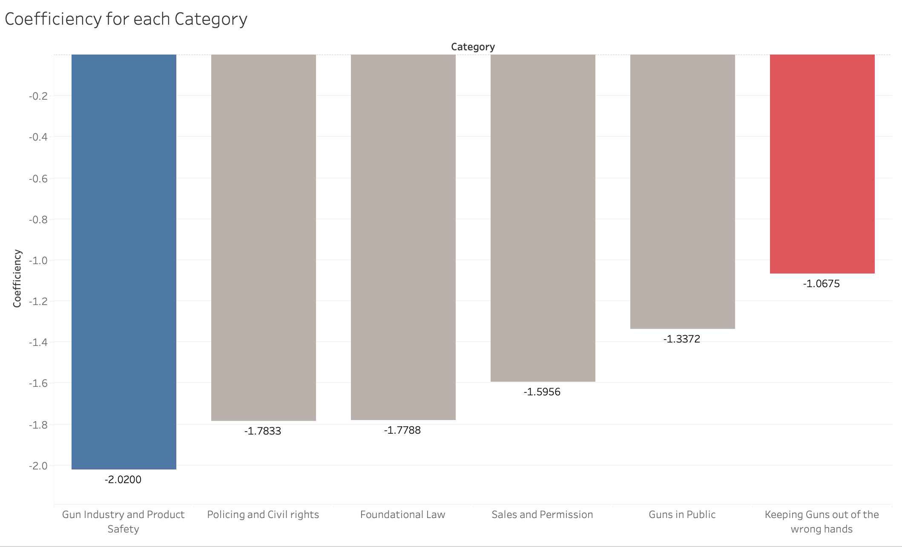
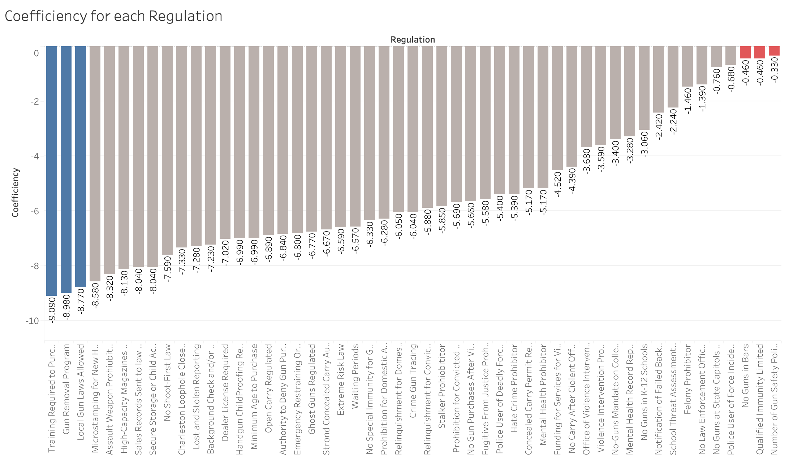
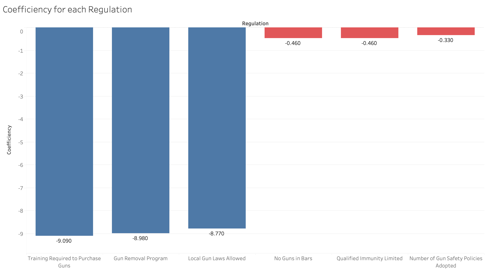

| [Home Page](https://github.com/yasu24/Telling-Story-with-Data) | [Data Visualization Critiques](data-visualization-critiques.md) | [Data Visualization Workshops](data-visualization-workshops.md) | [Final Project Part1](final-project-part1.md) | [Final Project Part2](final-project-part2.md) | [Final Project Part3](final-project-part3.md) |

# Final Project Part 2

Web page URL: [https://yasu24.github.io/Telling-Story-with-Data/final-project-part2.html](https://yasu24.github.io/Telling-Story-with-Data/final-project-part2.html)

This repository: [https://github.com/yasu24/Telling-Story-with-Data/Final Project Part2](https://github.com/yasu24/Telling-Story-with-Data/blob/main/final-project-part2.md)

## Wireframes/Storyboards

### Introduction, Approach, and Goal

As the Whitehouse announced, President Biden established the "Gun Violence Prevention Office" in Sep 2023.

This unprecedented move comes after a series of tragic shootings and consistent public outcry for stricter gun control. 

Ever since I moved to the US, I've been exposed to numerous gun-related news stories, including those from Pittsburgh.

Coming from Japan, where guns are far less common, my curiosity about this topic spurred this project.

Given the complexities surrounding American history and culture related to guns, this project will objectively focus on "Gun Violence" rather than debating the merits of gun ownership.

In this project, I would like to find any insight based on crime, regulation, or other available data.

The primary goal of this project is to contribute insights towards reducing gun violence and its victims. As such, the intended audience includes governmental officials and policymakers.

### Current Situation, Data, and Facts

We have the regulation ranking and its points for each state.

According to the Everytown Gun Law Rankings, the laws are categorized into 6 groups. 

We are going to focus on which category is the most effective in preventing the death rate and also what kind of laws work and don't work.

Categories
- Foundational Law
- Gun Industry and Product Safety
- Guns in Public
- Keeping Guns out of the wrong hands
- Policing and Civil rights
- Sales and Permitting

If we make a heatmap based on the result, we can show it as is.

Combined with "the gun death rate per 100k" data, all regulation data has a negative correlation, which means that if any regulation is added, the number of gun deaths will be reduced, which is a great fact.

Though there's a noticeable correlation between Regulation strength and Gun Death Rate, determining causality is more complex. 

Case1. Is the high Gun Death Rate a result of lenient regulations? 

Case2. Are regulations lenient because regions haven't historically perceived a need for tighter control due to lower gun death rates? 

Distinguishing between these two scenarios is crucial.

At the end of the fact data section, a correlation scatter plot between the two heatmaps above was created.

This trend line indicates that there is a negative correlation between "Regulation strength" and "Gun Death Rate".

### Analysis

According to the analysis, I would recommend implementing the training program for 41 states, which can lead to the result that around 372 people can be saved per 100k every year. 

How to implement the regulation? The economic, cultural, or historical difficulties would happen.

Initially, data was compared between "each state's laws" and "the gun death rate per 100k" to clarify which category is the most effective in preventing death using guns.

As shown above, the most efficient category is "Gun Industry and Product Safety". When a regulation is introduced to a state that doesn't have it, the number of deaths is reduced by 2.02 people per 100,000 people.

On the other hand, the least effective one is "Keeping Guns out of the wrong hands", which has only a 1.07 reduction.

When it comes to each regulation, we can see which regulation has more impact on the gun death rate.

And we can highlight the biggest and smallest impact items below.

If we focus on each regulation, The most significant impacted law is "Training Required to Purchase Guns", which has 9.09 people per 100,000 people.

This regulation is implemented in only 9 states, therefore, the remaining 41 states can reduce the number of deaths potentially.

Interestingly, one of the lowest impact regulations, the "No Guns in Bars" has an impact with a rate of 0.46, suggesting that restrictions on guns in bars have a lesser influence on gun-related deaths.

### Notes and Future Improvement

This calculation ignores the interactions between regulations, therefore there might be impacts because of the combination of some of them.

It's important to note that this is merely a binary (yes/no) analysis and a more in-depth examination is necessary. For instance, while the study mentions a "waiting period", we need to consider the exact length of time people must wait after purchasing before actually receiving their guns.

### Conclusion

In conclusion, this analysis has identified specific areas of regulation that can significantly reduce gun-related tragedies. While the current study employed a binary approach, future research would benefit from more nuanced methodologies, such as machine learning, to extract deeper insights from the data. 

As I plan to reside in the U.S. for some time, gaining an understanding of this topic has personal significance, and I look forward to delving further into this critical issue.

## Draft Shorthand based on the story and visualization above

[Link to Shorthand](https://preview.shorthand.com/vdPO6PZI8yCGN6FB)
* Recommended: Right-click the link and select "Open in a new tab"

### Note
This is a 1-minute version, so I omit most of the story above. 

Although I will mention it in the "Identified changes for Part 3" section, a full version will be created in Part 3(implementation phase).

# User research 

## Target audience
> Include your approach to identifying representative individuals, and who you hope to reach with your story. 

While the primary target audience is governmental officials and policymakers, public opinion is shaped by the masses. Thus, the general public, especially those concerned with gun regulations, is also considered a significant audience for this project.

## Interview script

The main goal of my research is to contribute insights towards reducing gun violence and its victims. 

The main goal of the interview is to clarify if my explanation is "Understandable", "Informative", and "Enhancement" or not.

| Goal | Questions to Ask |
|------|------------------|
| Understandable | Did you capture the main objective or message of the explanation? |
| Informative | Did you gain any new insights from the presentation? |
| Clear | Were there any parts of the presentation that felt confusing or that could be explained more clearly? |

## Interview findings

| Questions               | Feedback from 30s adult | Feedback from 20s student-1 | Feedback from 20s student-2 |
|-------------------------|--------------------------------|-------------|-------------|
| Did you capture the main objective or message of the explanation? | It is still hard to understand using the Shorthand version. Github story is more helpful as I can capture the logic | Yes, it was clear, but it would be better to use a large font or highlighting | Based on the shorthand, bold characters are a little weak to gather the audience's focus, so you might want to consider making them bolder or using another method to emphasize them |
| Did you gain any new insights from the presentation? | I understood which regulation and its category should be focused on | The Fact and message are clear, but the context is unclear | Visualized and categorized regulation is new to me |
| Were there any parts of the presentation that felt confusing or that could be presented more clearly? | To be more user-friendly. Shorthand should be longer as it is too short and hard to capture the message.  | Emphasize the message. Use colors more effectively. For instance, the main color of the first half is black, while the second half is white | More visualization can be added into shorthand. Dynamic visuals can be added. Story order can be reconsidered |

# Identified changes for Part 3
> Document the changes you plan on implementing next week to address any issues identified.  

Text here!

| Research synthesis                       | Anticipated changes for Part 3                                                  |
|------------------------------------------|---------------------------------------------------------------------------------|
| Findings or observations from interviews | Describe what, if any changes you anticipate making to address the observation. |
|                                          |                                                                                 |
|                                          |                                                                                 |
|                                          |                                                                                 |
| ...add more rows as necessary            |                                                                                 |

> ...include any final thoughts you have here. 

Text here!

# Moodboards / personas
> If you did this optional part, include details here.  Otherwise, remove this section

Text here!
